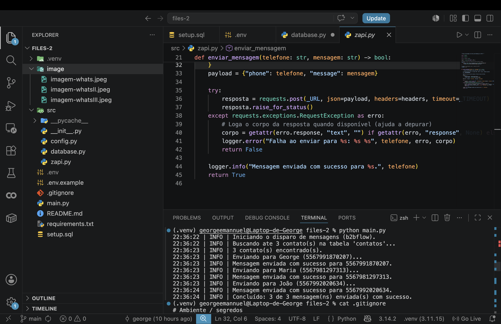

# Desafio b2bflow — Disparo de mensagens (Python + Supabase + Z-API)

Lê contatos cadastrados no **Supabase** e envia, via **Z-API**, a mensagem:

```
Olá, <nome_contato> tudo bem com você?
```

para até **3 números**, personalizando `<nome_contato>` com o campo do banco.

## Estrutura

```
.
├── main.py            # ponto de entrada (python main.py)
├── requirements.txt
├── .env.example       # modelo das variáveis de ambiente
├── setup.sql          # cria a tabela e insere exemplos
└── src/
    ├── config.py      # carrega e valida o .env
    ├── database.py    # busca os contatos no Supabase
    └── zapi.py        # envia a mensagem pela Z-API
```

## 1. Setup da tabela (Supabase)

1. Crie um projeto gratuito em [supabase.com](https://supabase.com).
2. Vá em **SQL Editor > New query**, cole o conteúdo de [`setup.sql`](./setup.sql) e rode.
   Isso cria a tabela `contatos` e insere alguns exemplos:

   | coluna         | tipo          | descrição                                  |
   | -------------- | ------------- | ------------------------------------------ |
   | `id`           | bigint        | chave primária (auto)                      |
   | `nome_contato` | text          | nome usado na mensagem                     |
   | `telefone`     | text          | DDI+DDD+número, ex.: `5567999999999`       |
   | `created_at`   | timestamptz   | data de criação (auto)                     |

3. Edite os números inseridos para **telefones que você controla** (vão receber a mensagem de verdade).

## 2. Variáveis de ambiente (.env)

Copie o modelo e preencha:

```bash
cp .env.example .env
```

| Variável              | Onde encontrar                                            |
| --------------------- | -------------------------------------------------------- |
| `SUPABASE_URL`        | Supabase → Project Settings → API → Project URL          |
| `SUPABASE_KEY`        | Supabase → Project Settings → API → `anon` `public`      |
| `ZAPI_INSTANCE_ID`    | Painel Z-API → Instâncias                                |
| `ZAPI_INSTANCE_TOKEN` | Painel Z-API → Instâncias (token da instância)           |
| `ZAPI_CLIENT_TOKEN`   | Painel Z-API → Segurança → Token de Segurança da Conta   |
| `SUPABASE_TABELA`     | (opcional) nome da tabela, padrão `contatos`             |
| `LIMITE_CONTATOS`     | (opcional) máximo de envios, padrão `3`                  |

> Importante: na Z-API, conecte a instância lendo o **QR Code** com o WhatsApp antes de rodar.

## 3. Como rodar

```bash
# (recomendado) ambiente virtual
python -m venv .venv
source .venv/bin/activate      # Windows: .venv\Scripts\activate

# dependências
pip install -r requirements.txt

# executar
python main.py
```

Saída esperada (logs):

```
12:00:00 | INFO | Iniciando o disparo de mensagens (b2bflow).
12:00:01 | INFO | Buscando até 3 contato(s) na tabela 'contatos'...
12:00:01 | INFO | 3 contato(s) encontrado(s).
12:00:01 | INFO | Enviando para George (5567999999999)...
12:00:02 | INFO | Mensagem enviada com sucesso para 5567999999999.
...
12:00:05 | INFO | Concluído: 3 de 3 mensagem(ns) enviada(s) com sucesso.
```

## Boas práticas adotadas

- Segredos em `.env` (fora do versionamento, via `.gitignore`).
- Configuração centralizada e **validada** em `config.py` (erro claro se faltar variável).
- Tratamento de erros de rede e **logs** em cada etapa.
- Código modular: banco, envio e orquestração separados.
- `timeout` nas requisições HTTP e código de saída coerente (`0` sucesso / `1` falha).

# Demostração dos Testes 

<p align="center">
  
</p>

<p align="center">
  
</p>

<p align="center">
  
</p>

<p align="center">
  
</p>
